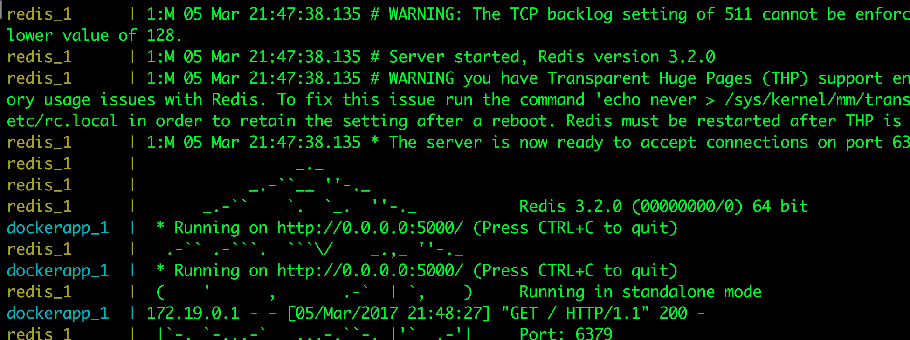
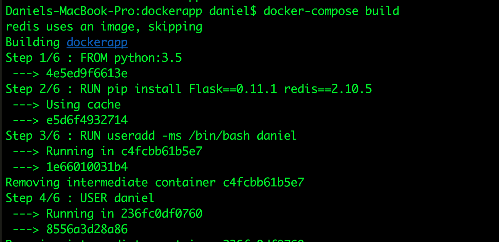
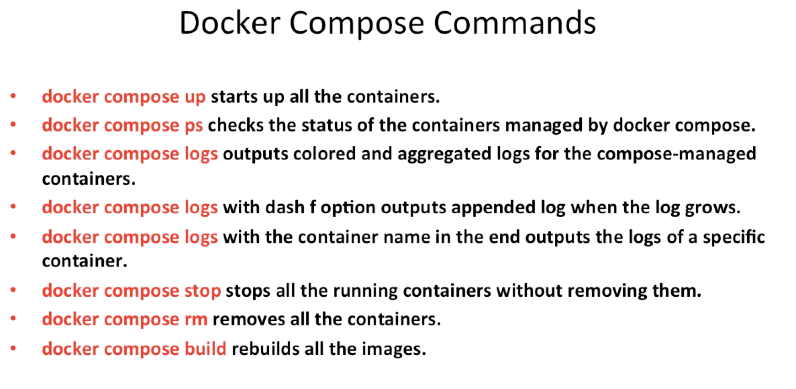
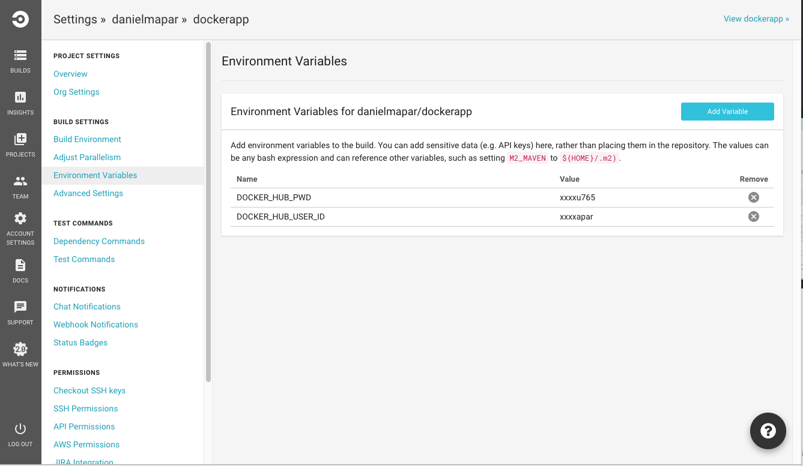

# Docker Tutorial

## Introduction to Virtualization Technologies

  

  

  

  - Hypervisors approach handles many VMs with their own copy of the OS/Kernel and only manages resources at hardware level.

    - Porting your VM from one Hypervisor (Virtual box for example) to another one is not easy.


  - Container-based approach holds a single kernel and shares the OS with the containers.

      - Less CPU, memory and disk usage
      - Faster to boast
      - Portable


- Docker runs in a client / server architecture.

  - The daemon is the server (docker server, docker engine)
    - daemon is a computer program that runs in the background
  - The user interacts with the daemon by using the docker client
    - Client 1: Command line client
    - Client 2: Kitematic (Graphical client)

  - In a typical Linux installation, the docker client, daemon and containers run in the same host.

    - You can also connect a docker client to a remote docker daemon

  - Docker daemon can't run natively in Windows and Linux machines. That is because Docker daemon uses Linux specific kernel features. Having said that, we need to run Docker daemon inside a Linux VM to make it work.
    - Lightweight docker vm that was made to run the docker daemon (HYPERKIT)

      

    - Old installation process using docker-toolbox:

      

      - Docker Client
      - Docker Machine
        - Lets you install docker engine in virtual hosts, and manage the hosts with docker machine commands.
      - Docker Compose
        - For defining and running multi container applications

      

      - ```docker-machine ls```: Lists all virtual machines running docker daemon

  - After installation you can use the docker client

    - ```docker info```: Outputs information about the docker environment (os, containers, images, etc)

    - ```docker version```: Prints the version of both docker client and docker server (docker daemon)


## Important Docker Concepts

  -  Images
    - Read only templates used to create containers
    - Are created with the ```docker build``` command, either by us or by other docker users
    - Are designed to be composed of layers of other images
    - Are stored in a Docker registry (Docker Hub)

  -  Container
    - If an image is a class, then a container is an instance of a class
    - They are a lightweight and portable encapsulations of an environment in which to run applications
    - We create a container from an Image. Inside that container we have all the binaries and dependencies we need to run our application.

  - Registry
    - Store our images
    - You can host your own registry, or use Dockers public registry (Docker Hub)
    - Inside a registry, images are stored in repositories
    - Docker repository is a collection of different docker images with the same name, that have different tags, each tag represents a version of the image (version of mysql for example)

  - Docker Hub (Registry)
    - New docker users are encouraged to use "official" repositories
      - Clear documentation
      - Docker incorporation dedicated a team for reviewing image content
      - Security updates in a timely manner

## Hello World Docker

  - When trying to create a container based on an image, Docker will first look for the image in the local box. If found, docker will use the local image. Otherwise, docker will download the image from the remote docker registry

    - ```docker images```: Show all local images available

    - ```docker run```: Creates the container based on the repository name and tag
    - ```docker run busybox:1.24 echo "Hello World"```: After spinning of the container running busybox version 1.24, docker will output "Hello World"

    - By running ```docker images``` again, you will now see budybox as part of your local images

    

    

  - To interact with the container and create a pseudo TTY (text-only console) we will use ```-i``` and ```-t``` respectively.

    - The ```-t``` flag creates a pseudo TTY that attaches ```stdin``` and ```stdout```


  - ```docker run -i -t busybox:1.24```: You will interact with the brand new container

  - **Important**: When you do ```docker -i -t run busybox:1.24``` as soon as you ```exit``` that container will be turned off.
    - This is a foreground execution

    - If you run ```docker -i -t run busybox:1.24``` again, that will spin a completely new container with none of the previous files from the last execution.

    - Check running containers by doing ```docker ps```
      - ```ps```: Stands for processes snapshot
      - You can also ```start``` and ```stop``` containers, but that will be covered in the next sections.

## Deep Dive into Docker Containers


  - You can use the ```-d``` option to run a container detached. That will output the container id.
    - ```docker run -d busybox:1.24```

  


  - ```docker ps -a```: The ```-a``` option stands for all containers. That includes the ones that got their execution stopped

  

  - In case we want to remove the container after exiting it, we can do: ```docker run --rm busybox:1.24```
    - ```--rm```: Remove option
    - Otherwise, the container will be turned off and hanging in the ```docker ps -a``` list.


  - We can also specify the name of the container we want to run
    - ```docker run --name hello_world busybox:1.24```
    - If we do not specify a name, Docker will automatically generate one for you

    - ```docker inspect ${containerId}```: This command outputs some useful low level information, such as the image id and the log path.

- ```docker ps -a | awk '{ print $1,$2 }' | grep ${imageName:tag} | awk '{print $1 }' | xargs -I {} docker rm {}```: Run this command to remove all containers based on an specific image and tag -> ```${imageName:tag}```

  - AWK is a programming language designed for text processing and typically used as a data extraction and reporting tool. It is a standard feature of most Unix-like operating systems.

## Docker Port Mapping and Docker Logs

  - ```-p host_port : container_port```: Port option
    - ```docker run -it -d -p 8888:8080 tomcat:8.0```

  - ```docker logs ${containerId}```: That will enable you to see the container logs

  


## Docker Image Layers


  - An image is made off read only layers. The first layer is the base layer (the OS for example). The other layers will come on top of it (ex: Apache, emacs, etc..)

  - ```docker history busybox:1.24```: Busybox image consists of 2 layers, the first one adds a file and the second runs bash

  - Every container has a thin R/W layer on top of the layers that comes with the image. Having said that, when we ```run``` and image, it will spawn a new container with all those image layers + this unique thin writable layer attached to the container.
    - When we delete the container, the image and it's layers are kept the same way. However, the thin layer is deleted, since it was attached to the container.

    

      - This image shows a diversity of containers sharing the same image ```ubuntu:15.04```. In addition to that, it also shows that every single container has a Thin R/W layer on top of the underlying image layers.


## Build Docker Images

  - Approach 1 (Committing changes):

    - We can commit changes made in a Docker container.

    - Steps
      1. Spin up a container from a base image

        - ```docker run -it debian:jessie```

      2. Install Git package in the container

        - ```apt-get update && apt-get install -y git```
          - ```-y```: To confirm 'yes' to prompts

      3. Commit changes made in the container

        - ```docker commit ${containerId} ${repositoryName:tag}```

        - Docker commit command would save the changes we made to the Docker container file system to a new image.

        
        

        - ```docker run -it danielmapar/debian:jessie```: Inside the container you see git installed

  - Approach 2 (Writing Docker File):

    - A Dockerfile is a text document that contains all the instructions users provide to assemble an image

    - Each instruction will create a new image layer to the image

    - Instructions specify what to do when building the image

    - Instructions (not case sensitive):

      - ```FROM```: Specify the base image
      - ```RUN```: Any command you can run in a linux terminal

      

    - ```docker build -t ${repository:tag} ${path}```: Build an image using instructions given in a Dockerfile
      - ```docker build -t danielmapar/debian-new:1.0 .```
      - If we don't specify a tag, Docker will use 'latest' as a tag

    - Docker build also requires the path of the build context as an argument.

      - This is needed so Docker can copy source files from the local OS to the docker image

      - When build starts, docker client would pack all files in the build context into a tarball (.tar) then transfer the tarball file to the daemon.

      - By default, docker would search for the Dockerfile in the build context path

      - ```docker build [OPTIONS] PATH```: Path in this case will be ```.```, the current one
        - Docker will look for the Dockerfile inside the ```PATH```. However, you can specify the Dockefile location by also using the ```-f``` flag (```-file```).

      

      - Steps:

        1. The first step is to pack all the files from the the build context and send it to the daemon.

        2. Docker spins a container with debian:jessie.

        3. Docker runs a command inside that container.

        4. Docker commits the changes done in that container, this way generating a new image.

        5. Docker deletes the container.

        6. Docker spins a container based on that new image.

        7. Back to step 3. (command per command)

  - To remove an image just do: ```docker rmi ${imageName:tag}```
    - Ex: ```docker rmi danielmapar/flask-test```

## Dockerfile In Depth

  - Each ```RUN``` command will execute the command on the top writable layer of the container, then commit the container as a new image.

  - The new image is used for the next step in the Dockerfile. So each ```RUN``` instruction will create a new image layer.

  - It is recommended to chain the ```RUN``` instructions in the Dockerfile to reduce the number of image layers it creates.

  - When writing the ```RUN``` instructions, sort multi-line arguments alphanumerically

  - Instead of:

    - ```RUN a```
    - ```RUN a```
    - ```RUN c```

    


  - just do ```RUN a && b && c```

  

  - ```docker build -t danielmapar/debian-new-2:1.0 -f Dockerfile-2 .```

  

  - The ```CMD``` instruction specifies what command you want to run **when the container starts up**.

  - If we don't specify ```CMD``` instruction in the Dockerfile, Docker will use the default command defined in the base image

    - The default command for debian jessie is ```bash```


  - The ```CMD``` instruction doesn't run when **building** the image, it only runs when the container starts up

  - You can specify the command in either exec form which is preferred or in shell form

    - ```CMD["echo", "Hello World!"]```

  

  

  - You can also supply a command to be executed right after the container starts by running: ```docker run danielmapar/debian-new-3:1.0 ls /``` or ```docker run danielmapar/debian-new-3:1.0 echo "Test"```

  - You can also test it by doing: ```docker start -i ${containerName}```

## Dockerfile Cache

  - Each time Docker executes an instruction it builds a new image layer

  - The next time, if the instruction doesn't change, Docker will simply reuse the existing layer.

  

  - ```docker build -t danielmapar/debian . --no-cache=true```
    - Using cache on ```apt-get update``` and ```apt-get install curl``` command can leave you with an older/cached version of ```curl``` instead of the latest

## COPY Instruction

  - The ```COPY``` instruction copies new files or directories from build context and adds them to the file system of the container.

  

## ADD Instruction

  - The ```ADD``` instruction cannot only copy files but also allow you to download a file from the internet and copy to the container.

  - ```ADD``` instruction also has the ability to automatically unpack compressed files

    - ```ADD http://example.com/big.tar.xz /usr/src/things/```
    - ```RUN tar -xJf /usr/src/things/big.tar.xz -C /usr/src/things```


  - The rule is: use ```COPY``` for the sake of transparency, unless you're absolutely sure you need ```ADD```.

  - For the ```ADD``` and ```COPY``` instructions, the contents of the file(s) in the image are examined and a checksum is calculated for each file. The last-modified and last-accessed times of the file(s) are not considered in these checksums. During the cache lookup, the checksum is compared against the checksum in the existing images. If anything has changed in the file(s), such as the contents and metadata, then the cache is invalidated.

## Push Images to Docker Hub

  - Create an account on https://hub.docker.com

  - Setup a repository.
    - Example: ```test_repo```

  

  - Tag one of your images with the proper repository:tag

    - ```docker images```

    - ```docker tag d5dc7cb2053d danielmapar/test_repo:1.00```

      - Tag will clone the image with the same image id, but with a new repository/tag.

  - Login to docker hub using your account

    - ```docker login```

  - Push the image

    - ```docker push danielmapar/test_repo:1.00```

- Note on Latest Tag

  - Docker will use latest as a default tag when no tag is provided

  - A lot of repositories use it to tag the most up-to-date stable image. However, this is still only a convention and is entirely not being enforced.

  - Images which are tagged latest will not be updated automatically when a newer version of the image is pushed to the repository.

  - Avoid using latest tag

## Dockerize a Hello World Web App

  - ```git clone -b v0.1 git@github.com:jleetutorial/dockerapp.git```
    - --branch/-b can also take tags and detaches the HEAD at that commit in the resulting repository.


  

  - ```useradd -ms /bin/bash admin```
    - ```-m```: 	Creates the home directory if it does not exist.
    - ```s```: User's login shell, which defaults to /bin/bash


  - ```USER admin```: This command ensures that we are running the app server under the ```admin``` user.
    - If you do not specify a user, it will be ran by the root user
    - An attacker could take advantage of being root


  - ```WORKDIR /app```: This instruction sets the working directory for any RUN, CMD, ENTRYPOINT, COPY and ADD instructions to follow it in the Dockerfile.

  - ```CMD ["python", "app.py"]```: Since we specified ```/app``` as an working dir, we can call app.py directly.

  - ```docker build danielmapar/flask-app:1.0 -f Dockerfile .```: Build image

  - ```docker run -d -p 5000:5000 danielmapar/flask-app:1.0```: Run container

  - ```docker exec -it ${containerId} bash```

  

  - ```ps aux```:
    - a = show processes for all users
    - u = display the process's user/owner
    - x = also show processes not attached to a terminal

  


## Docker Container Links


### Implement Simple Key-Value Lookup Service

  - ```cd dockerapp```

  - ```git checkout v0.3```

  - ```docker build -t  danielmapar/python-flask-app:2.0 -f Dockerfile .```

  - ```docker run -d -p 5000:5000 danielmapar/python-flask-app:2.0```

  - ```docker logs ${containerId}```
    - You will see that the connection to the redis container failed. Lets create it

  - ```docker run --name redis redis:3.2.0```

  - ```docker run -d -p 5000:5000 --link redis danielmapar/python-flask-app:2.0```
    - The ```--link``` property will enable the app container to reach the redis container

  - ```docker logs ${containerId}```
    - Now the connection is stablished and the app is working


### How container links work behind the scenes?

  - ```docker exec -it ${containerId} bash```

  - ```more /etc/hosts```
    - When the text passed to it is too large to fit on one screen, it pages it. You can scroll down but not up.

    - ```less``` will let you scroll both ways

    - Ex: ```ps -ef | more```

    - You will see the redis container ip listed in the ```hosts``` file.
      - The ```hosts``` file will be hit before the DNS for lookups.


  - ```docker inspect ${redisContainerId} | grep IP```

  

  - Let's ping redis inside the app container
    -  ```docker exec -it ${constainerId} bash```

    - ```ping redis```

  

### Benefits of Docker Container Link

  - The main use for docker container links is when we build an application with a microservice architecture, we are able to run many independent components in different containers.

  - Docker creates a source tunnel between the containers that doesn't need to expose any ports externally on the container.


## Docker Compose

  - Manual linking containers and configuring services become impractical when the number of containers grows

  - There are 2 versions of the compose file format (both written using YAML)

    - Version 1, which is the legacy format does not support volumes or networks

    - Version 2, which is the most up-to-date format

  - docker-compose.yaml:

    ```
    version: '2'
    services:
        dockerapp:
          build: . // defines the path to the Dockerfile (this file is in the same directory)
          ports:
            - "5000:5000" // host port : container port
          volumes:
            - ./app:/app // A volume is a designated directory in a container (persistent even when the container is off). It can be used to share data between the host machine and the container (share source code is an example). This way, we don't need to use COPY on the Dockerfile for the source code. Format is -> host directory : container directory

        redis:
          image: redis:3.2.0 // We can either build an image, or run an existent image (this is obligatory)
    ```

    - You might want to ask, why we don't need to define the linking between app and redis. This is because the version 2 docker-compose format supports docker network feature, which allows containers to be discovered by its name automatically. Also, any service can reach any service at its service name. So linking is not required any more (if you are using version 2, version 1 requires it)

    - ```git checkout v0.4```

    - ```docker-compose up -d```: Will build all images and run all the containers
      - ```-d```: Run in detached mode

    - ```docker-compose down```: Stops containers and removes containers, networks, volumes (if you use ```-v```), and images (if you pass ```--rmi all```) created by ```up```

    - ```docker-compose start```: Will start the containers

    - Docker compose is a very handy tool to quickly get docker environment up and running

    - Docker compose uses yaml files to store the configuration of all the containers, which removes the burden to maintain our scripts for docker orchestration (such as: starting, linking, stopping)

## Deep Dive into Docker Compose Workflow

  - ```docker-compose ps```: To check the status and ids of containers managed by compose
    - ```docker exec -it ${containerId} bash```

  - ```docker-compose logs -f```: Will output both containers logs as the file is getting appended (```-f``` option).

  

  - ```docker-compose logs ${containerName}```
    - The container name is inside the docker-compose file

  - ```docker-compose rm```: To completely remove the containers

  - Even after removing the containers, docker keeps the image the way it is. Having said that, if I change the Dockerfile and run ```docker-compose up``` again, it will won't apply my changes.
    - To re-build the image, you need to run ```docker-compose build```

  

  

  

## Introduction to Docker Networking

  

  - Docker uses the networking capabilities of the host machine OS to provide networking support for the containers running on the host machine.

  - Once the docker daemon is installed in the host machine, a network interface called docker0 is provisioned on the host, which will be used to bridge the traffic from the outside network to the internal containers hosted on the host machine.

  - Each container connects to the bridge network thought its container network interface. Containers can connect to each other and the outside world through this bridge network interface.

  - Docker Network Types:

    - Closed Network / None Network

    - Bridge Network

    - Host Network

    - Overlay Network

  - ```docker network ls```: Existing docker networks in host machine
    - Default is: ```bridge```, ```host``` and ```none```

## None Network

  - This network does not have any access to the outside world.

  - That container lacks a container interface, so it is totally isolated.

  - This kind of container is called **closed container**

  - ```docker run -d --net none busybox:1.24 sleep 1000```

  

  - Trying to reach Google public DNS
  - ```ifconfig```: Check containers network interfaces
  

## Bridge Network

  - Default type of network for docker containers.

  - All the containers in the same bridge network are connected with each other, and they can connect to the outside world via the bridge network interface.

  - ```docker network ls```

  - ```docker network inspect bridge```

  

  - The IP range of this subnet, is from 172.17.0.0 - 172.17.255.255 (16 bits - 2 bytes)

  - ```docker run -d --name container_1 busybox sleep 1000```
    - This time we don't need to provide the ```--net``` option since bridge is the default mode for docker containers.

  - ```docker exec -it container_1 ifconfig```

  

  - Lets spin another container and make both communicate with each other.

    - ```docker run -d --name container_2 busybox sleep 1000```

    - ```docker exec -it container_2 ifconfig```

  

  - ```docker exec -it container_1 ping 172.17.0.3```

  

    - You can also add ```container_2``` IP address to ```container_1``` by using the ```--link``` flag when spinning the container. That will append ```container_2``` IP inside ```/etc/hosts```


  - Containers can also use this private network interface to access the outside world

    - ```docker exec -it container_1 ping 8.8.8.8```

      - Googles public DNS

  - Lets create another bridge network and show that both containers we just created wont be able to access it.

  - ```docker network create --driver bridge my_bridge_network_test```

  - ```docker network ls```

  

  - ```docker network inspect my_bridge_network_test```

  

  - The IP range of this subnet, is from 172.20.0.0 - 172.20.255.255 (16 bits - 2 bytes)

  - ```docker run -d --name container_3 --net my_bridge_network_test busybox sleep 1000```

  

  - Trying to reach ```container_1``` from ```container_3``` wont be possible since those two containers are on to separate bridge networks. However, we can use a docker feature to enable this communication.

  - ```docker inspect container_1```
    - That will give you the IP address of the container


  - ```docker exec -it container_3 ping 172.17.0.2```
    - This will fail

  - Docker has a feature that allows us to connect a container to another network.
    - ```docker network connect bridge container_3```
    - ```docker exec -it container_3 ifconfig```


  

  - ```docker exec -it container_3 ping 172.18.0.2```

    - Lets ping ```container_1``` from ```container_3```


  


  - Disconnect ```container_3``` from bridge network and maintain it connected to ```my_bridge_network_test```.

    - ```docker network disconnect bridge container_3```
    - ```docker exec -it container_3 ifconfig```


  


## Host and Overlay Network

### Host

   - Least protected network model, it adds a container on the host's network stack.

   - Container deployed on the host stack have full access to the host's interface.

   - This kind of containers are usually called **open containers**

   - ```docker run -d --name container_4 --net host busybox sleep 1000```

   - ```docker exec -it container_4 ifconfig```

   

   - This container has all network interfaces present in the host machine. Those are all accessible by the container

   - Minimum network security level

   - No isolation on this type of open containers, thus leave the container widely unprotected

   - Containers running in the host network stack should see a higher level of performance than those traversing the docker0 bridge and iptables port mapping

### Overlay Network

  - All the network models we covered previously, including none, bridged and host haves one limitation. They can only be deployed on single host.

  - If you want to create a network across multiple host machines, you would need the overlay network model.

  - Require some pre-existing conditions before it can be created.

  - Running Docker engine in Swarm mode.
    - You can create an overlay network on the manager node.
    - A key-value store such as consul

  - Overlay Network is widely used in production

## Define Container Networks with Docker Compose

  - Define network models thought docker compose file

  - By default docker compose sets up a single network for your services

  - ```cd dockerapp && git stash && git checkout v0.4```

  - ```docker-compose up -d```

  - ```docker network ls```

  

  - ```docker-compose down```: Stops containers and removes containers, **networks**, volumes (if you use ```-v```), and images (if you pass ```--rmi all```) created by ```up```

  

  - Specify a network

  ```version: '2'

  networks:
    my_net:
      driver: bridge

  services:
    dockerapp:
      build: .
      ports:
        - "5000:5000"
      volumes:
        - ./app:/app
      networks:
        - my_net

    redis:
      image: redis:3.2.0
      networks:
        - my_net
  ```

  - ```docker-compose up -d```

  

  - ```docker inspect -f '{{range .NetworkSettings.Networks}}{{.IPAddress}}{{end}}' dockerapp_dockerapp_1```

  

  

## Write and Run Unit Tests in Docker Containers

  - Unit tests should test some basic functionality of our docker app code, with no reliance on external service

  -  Unit tests should run as quickly as possible so that developers can iterate much faster without being blocked by waiting for the test results

  - Docker containers can spin up in seconds and can create a clean and isolated environment which is a great tool to run unit tests with


  - ```git stash && git checkout v0.5```

  - ```docker-compose run ${serviceName} python test.py```
    - ```docker-compose run dockerapp python test.py```
    - We over written the default CMD ```CMD ["python", "app.py"]``` to run the test file instead

  

  - Pros:
    - A single image is used through development, testing and production, which greatly ensures the reliability of our tests

  - Cons:
    - It increases the size of the image

## Introduction to Continuous Integration

  - What is continuous integrations?

    - Continuous integration is a software engineering practice in which isolated changes are immediately tested and reported when they are added to a large code base

    - The goal of CI is to provide rapid feedback so that if a defect is introduced into the code base, it can be identified and corrected as soon as possible

  

  

  - In a world with docker what usually happens is that the CI server would build the docker image after it has build the application. The application goes inside the image, and CI server pushes the image to a Docker registry. Having said that, you can pull the brand new build image from docker registry, and run the container in another host (dev, staging, or even production environment)

  

  - Circle CI build steps are defined in a ```circle.yml``` file, which should be checked in to the root of your repository

  ```

  /*
  CircleCI works well for Python projects. We run automatic inference on each build to determine your dependencies and test commands. If we don’t infer all of your settings, you can also add custom configuration to a circle.yml file checked into your repo’s root directory.
  */

  machine: // configures the VM on the CircleCI server that runs your tests
    pre: // configure the VM to install docker 1.10.0, which is above the minimum docker version to support docker-compose command
      - curl -sSL https://s3.amazonaws.com/circle-downloads/install-circleci-docker.sh | bash -s -- 1.10.0
    services:
      - docker

  dependencies: // used to setup the projects language specific dependencies. Where we install docker compose
    pre:
      - sudo pip install --upgrade pip
      - sudo pip install docker-compose==1.9.0

  test: // Defines how to run the tests
    override:
      - docker-compose up -d
      - docker-compose run dockerapp python test.py

  ```

  - ```docker-compose run```: Commands you use with run start in new containers with configuration defined by that of the service, including volumes, links, and other details. However, there are two important differences.

  

  

  ```deployment:
  hub:
    branch: /.*/ # [cicle_ci_publish, master]
    commands:
      - docker login -e $DOCKER_HUB_EMAIL -u $DOCKER_HUB_USER_ID -p $DOCKER_HUB_PWD
      - docker tag dockerapp_dockerapp $DOCKER_HUB_USER_ID/dockerapp:$CIRCLE_SHA1
      - docker tag dockerapp_dockerapp $DOCKER_HUB_USER_ID/dockerapp:latest
      - docker push $DOCKER_HUB_USER_ID/dockerapp:$CIRCLE_SHA1 # $CIRCLE_SHA1 current commit hash of the repository
      - docker push  $DOCKER_HUB_USER_ID/dockerapp:latest
  ```

  

  

# Introduction to Running Docker in Production

## Why Running Docker Containers inside VMs

  - To address security concerns.
    - Ensure people don't access each other network traffic.
  - Hardware level isolation.
    - All container share kernel resources, if one container can monopolize kernel resource, it can starve other container in the same host. DDoS attack.
  - Both Google Container Engine and Amazon EC2 Container Service use VM internally.

  - Docker machine
     - Can Provision new VMs
     - Install Docker Engine
     - Configure Docker Client
     - We will need virtual box (to provision linux VMs)
     - Docker machine also provides different drivers for most of the popular cloud providers (Amazon, Google, Digital Ocean). This way you can use docker machine to provision vms in the cloud environment.

## Steps

  - Remove the
    ```
    volumes:
      - ./app:/app
    ```

  - Copy the app using the Dockerfile. ```COPY app /app```

  

## Register Digital Ocean Account to Deploy Dockerized Applications

  - Access ```www.digitalocean.com```

  - Create your account and your OAuth token to access Digital Ocean API

  - We will use ```docker-machine``` to manager our VMs and configure them to run docker-engine + docker containers.

  

  - ```docker-machine create --driver digitalocean --digitalocean-access-token ${token} docker-app-machine```

  - After that we will configure some env variable to setup this new VM inside ```docker-machine```

  

  - ```docker-machine env docker-app-machine```: outputs the environment variables

  - ```eval $(docker-machine env docker-app-machine)```

  - ```docker info```

  - Now we got your docker VM provisioned

  - Make a ```prod.yml``` and change ```build: .``` to ```image: danielmapar/docker-app```
    - This will get your image tagged latest

  - ```docker-compose -f prod.yml up -d```
    - This will deploy all the service defined in the docker-compose file inside the remote VM

  - ```docker-machine ls```: Now we can see our ACTIVE digital ocean VM

  

  - ```ACTIVE``` VM means that if we don't specify a VM to run a command, it will run on the ACTIVE one

  

  - We can also explore more about the Digital Ocean driver to find other interesting configurations

# Introduction to Docker Swarm and Service Discovery

  - Complicated system that consists of a tone of containers, and those can't fit in a single host. Scale docker for large applications.

  - Docker Swarm is a tool that clusters many Docker Engines and schedules containers.

  - Docker Swarm decides which host to run the container based on your scheduling methods.

  

  - We have some remote hosts on the cloud, and Docker Daemons are running on those hosts. The Swarm manager will be connected each and every Docker Daemon based on your discovery method. So now, the Swarm manager knows the status of all the nodes in the cluster.

  - When you decide to run a container, the Swarm manager decides where the container runs, you just need to point your Docker Client to the Swarm manager instead of each and every Docker Daemon.

  - Basically, Docker Swarm can group multiple hosts into a cluster and distribute Docker containers among these hosts. So the work load is divided by the nodes in the Swarm, and this is transparent to the end users.

  - In this way, it outsources the manual schedule and workload from the client to the Swarm manager. It is also possible to point multiple Docker Clients to a single Docker Swarm manager. So then multiple users can share the same cluster.

  - First of all, lets export the digital ocean environment variable to make our life easier: ```export DIGITALOCEAN_ACCESS_TOKEN=asdasdas```

  - Also, let's set the private networking flag on digital ocean, this way it will create a private network for our hosts to communicate: ```export DIGITALOCEAN_PRIVATE_NETWORKING=true```. In this way we can avoid exposing our container to the internet.

  - Finally, we create an environment variable to define the OS for ours hosts in Digital Ocean: ```export DIGITALOCEAN_IMAGE=debian-8-x64```

  - To create a Swarm we need access to a key-value store for service discovery and to store configuration.

  - Service Discovery
     - Service discovery a key component of most distributed systems and service oriented architectures.

     - In the context of Docker Swarm, service discovery is about how the Swarm Manager keeps tracks of the state of all the nodes in the cluster.

     

     - Swarm supports various distributed key-value stores

      - Consul
      - Apache ZooKeeper


  - Procedures to deploy our Docker app on the Swarm cluster

    - ***Step 1***: Provision a consul machine and run a consul server on top of it as a key value store for service discovery.

    - ***Step 2***: Provision a Docker Swarm master node.

    - ***Step 3***: Provision a Docker Swarm slave node.

    - ***Step 4***: Define the overlay network to support multi-host networking.

    - ***Step 5***: Deploy our Docker app services on the Swarm cluster via Docker compose.

  - ***Step 1***:

    - ```docker-machine create -d digitalocean consul```

    - ```-d``` stands for driver

    - ```docker-machine ssh consul ifconfig```
       - Will run a command in a machine using ssh

    

    - The machine contains 4 network interfaces
      1. ```docker0``` is created by docker in order to enable the communication between containers
      2. ```eth0``` allows inbound and outbound access to the entire internet
      3. ```eth1``` a private network that enables private networking between hosts in the same data center
      4. ```lo``` loop back interface

    - We will use ```eth1``` so we don't expose our key-value store to the entire internet

    - Let's try to ping the public and private ip address of the machine for the sake of testing
      - ```ping -c 1 $(docker-machine ssh consul 'ifconfig eth0 | grep "inet addrs:" | cut -d: -f2 | cut -d" " -f1')```
        - ```-c count```: Stop after sending count ECHO_REQUEST packets. With deadline option, ping waits for count ECHO_REPLY packets, until the timeout expires.
        - This command will print out the command interface of ```eth0```
        - Grep the line which contains the ip address
        - Remove all other texts, so the ip address is the only thing left
        - Then, it tries to ping the echoed ip address from local host
        - The ping works, since this is the public ip.
      - ```ping -c 1 $(docker-machine ssh consul 'ifconfig eth1 | grep "inet addrs:" | cut -d: -f2 | cut -d" " -f1')```
        - This wont work, since it is the private network ip.

    - Let's save the private ip in an environment variable: ```export KV_IP=ping -c 1 $(docker-machine ssh consul 'ifconfig eth1 | grep "inet addrs:" | cut -d: -f2 | cut -d" " -f1')```

    - Next we will connect our docker client to this newly created host
      - ```eval $(docker-machine env consul)```
      - ```docker run -d -p ${KV_IP}:8500:8500 --restart always gliderlabs/consult-server -bootstrap```
        - Docker ```-p``` takes an optional parameter to specify the network interface that the exposed container port should be mapped to. We will map to the private network ip
        - ```--restart always```: Always restart the container, regardless of the exit status. Restart the container regardless. This insures the consul container is always running
        - ```gliderlabs/consul-server```: The consul image
          - ```-bootstrap```: One of the consul server options, which will bootstrap a consul cluster with a single node.

  - ***Step 2 and 3***:

    - ***important note***: Docker now allows orchestrating swarm without setting up counsel by simply using ```docker swarm init``` and ```docker swarm join```.

    - Let's provision a Docker Swarm master node

    - ```docker-machine create -d digitalocean --swarm --swarm-master --swarm-discovery="consul://${KV_IP}:8500" --engine-opt="cluster-store=consul://${KV_IP}:8500" --engine-opt="cluster-advertise=eth1:2376" master```

      - A Swarm cluster consists of a master node, which is effectively the swarm manager.
      - Swarm manager is responsible for the entire cluster and manages the resources of multiple nodes at scale
      - The ```swarm-master``` flag is used to identify this node as the Swarm master.
      - We also need to provide the consult endpoint with its protocol ```consul://```: ```--swarm-discovery="consul://${KV_IP}:8500"```
      - ```--engine-opt="cluster-store=consul://${KV_IP}:8500" --engine-opt="cluster-advertise=eth1:2376"```: The ```--engine-opt``` lets us set docker daemon options, in this case we are telling docker daemon which key-value store to use for cluster coordination. Also, we set ```cluster-advertise=eth1:2376``` which provides an address that the created docker daemon should advertise as connectable to the cluster, using the key-value store.
      - Finally, we name this host ```master```

    - Now, lets provision a Docker Swarm slave node
      - ```docker-machine create -d digitalocean --swarm --swarm-discovery="consul://${KV_IP}:8500" --engine-opt="cluster-store=consul://${KV_IP}:8500" --engine-opt="cluster-advertise=eth1:2376" slave```

    - Let's connect our docker client to the swarm master: ```eval $(docker-machine env -swarm master)```

    - ```docker-machine ls```
    

    - We can check the Docker Swarm cluster information by running ```docker info```
    

    - It is important to note that when we spin the master node (swarm master), it also spins a swarm agent inside the vm (master and slave at the same time). That is why we have 2 containers inside the master host, and one single container inside the slave host.

    

    - Swarm master is responsible to decide which host to run containers and it can also run containers on it self

  - ***Step 4 and 5***:

    - Let's define the overlay network to support multi-host networking

    - We will need to make one change to the docker-compose file

    ```version: '2'
    services:
      dockerapp:
        extends:
          file: common.yml
          service: dockerapp
        image: danielmapar/dockerapp
        environment:
          - constraint:node==master // Make it run in the node-master host
        depends_on: // This will make docker-compose starts services in dependency order
          - redis
        networks:
          - mynet

      redis:
        extends:
          file: common.yml
          service: redis
        networks:
          - mynet

    networks:
      mynet:
        driver: overlay
    ```

    -  Time to run ```docker-compose -f prod.yml up -d```
    - ```docker ps```

    

    - We have our docker-app running in our master host, and redis running on our slave host. This scheduling strategy can be modified in the yml file. Otherwise, it will be automatic
