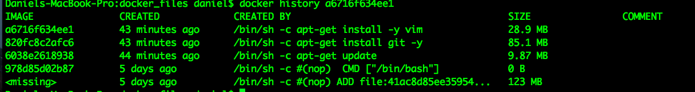

# Docker Tutorial

## Introduction to Virtualization Technologies


  - Hypervisors approach is to handle many VMs with their own copy of the OS/Kernel and only manager resources at hardware level.

    - Porting your VM from one Hypervisor (Virtual box for example) to another one is not easy.


  - Container-based approach holds a single kernel and shares the OS with the containers.

      - Less CPU, memory and disk usage
      - Faster to boast
      - Portable


- Docker runs in a client / server architecture.

  - The daemon is the server (docker server, docker engine)
    - daemon is a computer program that runs in the background
  - The user interacts with the daemon by using the docker client
    - Client 1: Command line client
    - Client 2: Kitematic (Graphical client)

  - In a typical Linux installation, the docker client, daemon and containers run in the same host.

    - You can also connect a docker client to a remote docker daemon

  - Docker daemon can't run natively in Windows and Linux machines. That is because Docker daemon uses Linux specific kernel features. Having said that, we need to run Docker daemon inside a Linux VM to make it work.
    - Lightweight docker vm that was made to run the docker daemon (HYPERKIT)

      

    - Old installation process using docker-toolbox:

      

      - Docker Client
      - Docker Machine
        - Lets you install docker engine in virtual hosts, and manage the hosts with docker machine commands.
      - Docker Compose
        - For defining and running multi container applications

      

      - ```docker-machine ls```: Lists all virtual machines running docker daemon

  - After installation you can use the docker client

    - ```docker info```: Outputs information about the docker environment (os, containers, images, etc)

    - ```docker version```: Prints the version of both docker client and docker server (docker daemon)


## Important Docker Concepts

  -  Images
    - Read only templates used to create containers
    - Are created with the ```docker build``` command, either by us or by other docker users
    - Are designed to be composed of layers of other images
    - Are stored in a Docker registry (Docker Hub)

  -  Container
    - If an image is a class, then a container is an instance of a class
    - They are a lightweight and portable encapsulations of an environment in which to run applications
    - We create a container from an Image. Inside that container we have all the binaries and dependencies we need to run our application.

  - Registry
    - Store our images
    - You can host your own registry, or use Dockers public registry (Docker Hub)
    - Inside a registry, images are stored in repositories
    - Docker repository is a collection of different docker images with the same name, that have different tags, each tag represents a version of the image (version of mysql for example)

  - Docker Hub (Registry)
    - New docker users are encouraged to use "official" repositories
      - Clear documentation
      - Docker incorporation dedicated a team for reviewing image content
      - Security updates in a timely manner

## Hello World Docker

  - When trying to create a container based on an image, Docker will first look for the image in the local box. If found, docker will use the local image. Otherwise, docker will download the image from the remote docker registry

    - ```docker images```: Show all local images available

    - ```docker run```: Creates the container based on the repository name and tag
    - ```docker run busybox:1.24 echo "Hello World"```: After spinning of the container running busybox version 1.24, docker will output "Hello World"

    - By running ```docker images``` again, you will now see budybox as part of your local images

    

    

  - To interact with the container and create a pseudo TTY (text-only console) we will use ```-i``` and ```-t``` respectively.

    - The ```-t``` flag creates a pseudo TTY that attaches ```stdin``` and ```stdout```


  - ```docker run -i -t busybox:1.24```: You will interact with the brand new container

  - **Important**: When you do ```docker -i -t run busybox:1.24``` as soon as you ```exit``` that container will no longer exist (including files, folder, etc..)
    - This is a foreground execution

    - If you run ```docker -i -t run busybox:1.24``` again, that will spin a completely new container with none of the previous files from the last execution.

    - Check running containers by doing ```docker ps```
      - ```ps```: Stands for processes snapshot

## Deep Dive into Docker Containers


  - You can use the ```-d``` option to run a container detached. That will output the container id.
    - ```docker run -d busybox:1.24```

  


  - ```docker ps -a```: The ```-a``` option stands for all containers. That includes the ones that got their execution stopped

  

  - In case we want to remove the container after exiting it, we can do: ```docker run --rm busybox:1.24```
    - ```--rm```: Remove option

  - We can also specify the name of the container we want to run
    - ```docker run --name hello_world busybox:1.24```
    - If we do not specify a name, Docker will automatically generate one for you

    - ```docker inspect ${containerId}```: This command outputs some useful low level information, such as the image id and the log path.

- ```docker ps -a | awk '{ print $1,$2 }' | grep ${imageName:tag} | awk '{print $1 }' | xargs -I {} docker rm {}```: Run this command to remove all containers based on an specific image and tag -> ```${imageName:tag}```

  - AWK is a programming language designed for text processing and typically used as a data extraction and reporting tool. It is a standard feature of most Unix-like operating systems.

## Docker Port Mapping and Docker Logs

  - ```-p host_port : container_port```: Port option
    - ```docker run -it -d -p 8888:8080 tomcat:8.0```

  - ```docker logs ${containerId}```: That will enable you to see the container logs

  


## Docker Image Layers


  - An image is made off read only layers. The first layer is the base layer (the OS for example). The other layers will come on top of it (ex: Apache, emacs, etc..)

  - ```docker history busybox:1.24```: Busybox image consists of 2 layers, the first one adds a file and the second runs bash

  - Every container has a thin R/W layer on top of the layers that comes with the image. Having said that, when we ```run``` and image, it will spawn a new container with all those image layers + this unique thin writable layer attached to the container.
    - When we delete the container, the image and it's layers are kept the same way. However, the thin layer is deleted, since it was attached to the container.

    

      - This image shows a diversity of containers sharing the same image ```ubuntu:15.04```. In addition to that, it also shows that every single container has a Thin R/W layer on top of the underlying image layers.


## Build Docker Images

  - Approach 1 (Committing changes):

    - We can commit changes made in a Docker container.

    - Steps
      1. Spin up a container from a base image

        - ```docker run -it debian:jessie```

      2. Install Git package in the container

        - ```apt-get update && apt-get install -y git```
          - ```-y```: To confirm 'yes' to prompts

      3. Commit changes made in the container

        - ```docker commit ${containerId} ${repositoryName:tag}```

        - Docker commit command would save the changes we made to the Docker container file system to a new image.

        
        

        - ```docker run -it danielmapar/debian:jessie```: Inside the container you see git installed

  - Approach 2 (Writing Docker File):

    - A Dockerfile is a text document that contains all the instructions users provide to assemble an image

    - Each instruction will create a new image layer to the image

    - Instructions specify what to do when building the image

    - Instructions (not case sensitive):

      - ```FROM```: Specify the base image
      - ```RUN```: Any command you can run in a linux terminal

      

    - ```docker build -t ${repository:tag} ${path}```: Build an image using instructions given in a Dockerfile
      - ```docker build -t danielmapar/debian-new:1.0 .```
      - If we don't specify a tag, Docker will use 'latest' as a tag

    - Docker build also requires the path of the build context as an argument.

      - This is needed so Docker can copy source files from the local OS to the docker image

      - When build starts, docker client would pack all files in the build context into a tarball (.tar) then transfer the tarball file to the daemon.

      - By default, docker would search for the Dockerfile in the build context path

      - ```docker build [OPTIONS] PATH```: Path in this case will be ```.```, the current one
        - Docker will look for the Dockerfile inside the ```PATH```. However, you can specify the Dockefile location by also using the ```-f``` flag (```-file```).

      

      - Steps:

        1. The first step is to pack all the files from the the build context and send it to the daemon.

        2. Docker spins a container with debian:jessie.

        3. Docker runs a command inside that container.

        4. Docker commits the changes done in that container, this way generating a new image.

        5. Docker deletes the container.

        6. Docker spins a container based on that new image.

        7. Back to step 3. (command per command)

## Dockerfile In Depth

  - Each ```RUN``` command will execute the command on the top writable layer of the container, then commit the container as a new image.

  - The new image is used for the next step in the Dockerfile. So each ```RUN``` instruction will create a new image layer.

  - It is recommended to chain the ```RUN``` instructions in the Dockerfile to reduce the number of image layers it creates.

  - When writing the ```RUN``` instructions, sort multi-line arguments alphanumerically

  - Instead of:

    - ```RUN a```
    - ```RUN a```
    - ```RUN c```

    


  - just do ```RUN a && b && c```

  

  - ```docker build -t danielmapar/debian-new-2:1.0 -f Dockerfile-2 .```

  

  - The ```CMD``` instruction specifies what command you want to run **when the container starts up**.

  - If we don't specify ```CMD``` instruction in the Dockerfile, Docker will use the default command defined in the base image

    - The default command for debian jessie is ```bash```


  - The ```CMD``` instruction doesn't run when **building** the image, it only runs when the container starts up

  - You can specify the command in either exec form which is preferred or in shell form

    - ```CMD["echo", "Hello World!"]```

  

  

  - You can also supply a command to be executed right after the container starts by running: ```docker run danielmapar/debian-new-3:1.0 ls /``` or ```docker run danielmapar/debian-new-3:1.0 echo "Test"```

  - You can also test it by doing: ```docker start -i ${containerName}```

## Dockerfile Cache

  - Each time Docker executes an instruction it builds a new image layer

  - The next time, if the instruction doesn't change, Docker will simply reuse the existing layer.

  

  - ```docker build -t danielmapar/debian . --no-cache=true```
    - Using cache on ```apt-get update``` and ```apt-get install curl``` command can leave you with an older/cached version of ```curl``` instead of the latest

## COPY Instruction

  - The ```COPY``` instruction copies new files or directories from build context and adds them to the file system of the container.

  

## ADD Instruction

  - The ```ADD``` instruction can not only copy files but also allow you to download a file from the internet and copy to the container.

  - ```ADD``` instruction also has the ability to automatically unpack compressed files

    - ```ADD http://example.com/big.tar.xz /usr/src/things/```
    - ```RUN tar -xJf /usr/src/things/big.tar.xz -C /usr/src/things```


  - The rule is: use ```COPY``` for the sake of transparency, unless you're absolutely sure you need ```ADD```.

  - For the ```ADD``` and ```COPY``` instructions, the contents of the file(s) in the image are examined and a checksum is calculated for each file. The last-modified and last-accessed times of the file(s) are not considered in these checksums. During the cache lookup, the checksum is compared against the checksum in the existing images. If anything has changed in the file(s), such as the contents and metadata, then the cache is invalidated.

## Push Images to Docker Hub

  - Create an account on https://hub.docker.com

  - Setup a repository.
    - Example: ```test_repo```

  

  - Tag one of your images with the proper repository:tag

    - ```docker images```

    - ```docker tag d5dc7cb2053d danielmapar/test_repo:1.00```

      - Tag will clone the image with the same image id, but with a new repository/tag.

  - Login to docker hub using your account

    - ```docker login```

  - Push the image

    - ```docker push danielmapar/test_repo:1.00```

- Note on Latest Tag

  - Docker will use latest as a default tag when no tag is provided

  - A lot of repositories use it to tag the most up-to-date stable image. However, this is still only a convention and is entirely not being enforced.

  - Images which are tagged latest will not be updated automatically when a newer version of the image is pushed to the repository.

  - Avoid using latest tag
